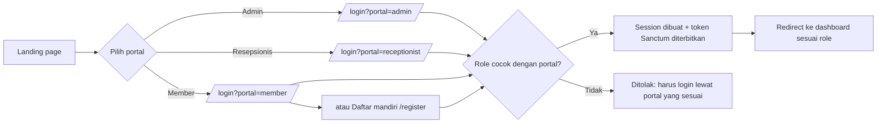
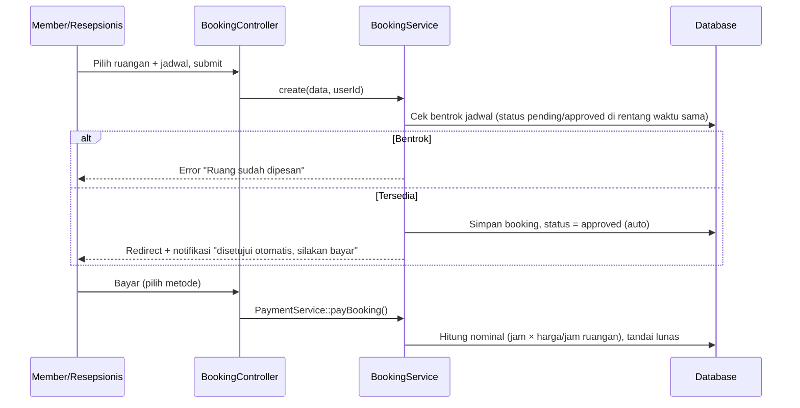
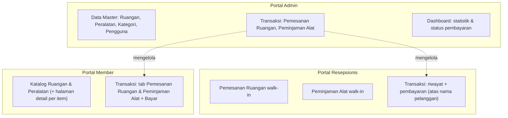

# F-Studio  - Smart-Hub Management System

**Nama:** Rizky Fadhillah
**NIM:** 411253001

## Ringkasan

F-Studio adalah sistem manajemen studio kreatif (booking ruangan foto/video/podcast dan peminjaman peralatan produksi) yang melayani tiga peran pengguna  admin, resepsionis, dan member  dalam satu aplikasi web terpadu. Dibangun sebagai monolith Laravel + Inertia.js + Vue 3, aplikasi ini menggabungkan manajemen data master, alur transaksi otomatis (auto-approve), dan simulasi pembayaran dalam satu basis kode yang sama.

---

## 1. Informasi Non-Teknis

### 1.1 Apa yang diselesaikan aplikasi ini

Studio kreatif (foto, video, podcast, coworking) biasanya mengelola jadwal ruangan dan peminjaman alat secara manual  buku catatan, chat WhatsApp, atau spreadsheet  yang rawan bentrok jadwal dan sulit dilacak. F-Studio menggantikan proses itu dengan:

- Katalog ruangan & peralatan yang bisa dilihat publik (landing page) maupun dipesan langsung oleh member.
- Pengecekan bentrok jadwal otomatis (ruangan) dan validasi stok otomatis (peralatan) berbasis rentang tanggal.
- Pencatatan status transaksi yang bisa dipantau semua pihak (disetujui, selesai, terlambat, dsb).
- Simulasi pembayaran per transaksi (bukan payment gateway sungguhan) untuk melengkapi alur bisnis end-to-end.

### 1.2 Peran pengguna

| Peran | Ringkasan tugas | Portal |
|---|---|---|
| **Admin** | Kelola data master (ruangan, peralatan, kategori, pengguna), pantau & ubah status semua transaksi, lihat dashboard ringkasan operasional & pembayaran. | `/dashboard` |
| **Resepsionis** | Buat pemesanan ruangan & peminjaman alat atas nama pelanggan walk-in (tanpa akun), proses pembayaran di tempat, lihat jadwal harian. | `/receptionist` |
| **Member** | Daftar mandiri, jelajahi katalog, pesan ruangan / pinjam alat untuk diri sendiri, bayar transaksi sendiri, pantau riwayat. | `/member` |

### 1.3 Akun demo (login)

Semua akun di bawah memakai password yang sama untuk keperluan demo/penilaian:

| Role | Email | Password |
|---|---|---|
| Admin | `admin@gmail.com` | `password123` |
| Resepsionis | `resepsionis01@gmail.com` | `password123` |
| Member | `rizky@gmail.com` | `password123` |

Login lewat halaman `/login` dan pilih portal yang sesuai (Admin/Resepsionis/Member) di bagian bawah form   role akun harus cocok dengan portal yang dipilih.

### 1.4 Fitur utama

- **Landing page publik**,  katalog ruangan & peralatan bisa dilihat tanpa login, plus halaman demo API (Postman collection) untuk keperluan dokumentasi/penilaian.
- **Pemesanan ruangan**, pilih ruangan, tentukan jadwal, langsung disetujui otomatis (tidak perlu menunggu admin).
- **Peminjaman peralatan**, pilih alat & jumlah, sistem otomatis mengecek dan mengunci stok yang tersedia pada rentang tanggal tersebut.
- **Pembayaran simulasi**, setelah transaksi disetujui, pengguna memilih metode bayar (tunai/transfer/e-wallet/QRIS) dan sistem menandai lunas dengan nominal yang dihitung otomatis dari harga ruangan/alat.
- **Pembatalan**, member/resepsionis bisa membatalkan transaksi yang belum dibayar.
- **Check-in/out via API**, fitur demo terpisah yang mencatat serah-terima fisik alat (dipakai untuk menunjukkan integrasi REST API bertoken, bukan bagian alur utama UI).
- **Dashboard**, khusus tiap peran, menampilkan ringkasan jumlah transaksi, status pembayaran, dan aktivitas terbaru.
- **Laporan Transaksi** (admin & resepsionis), rekap pemesanan ruangan + peminjaman alat dalam satu tabel, bisa disaring per rentang tanggal/jenis/status pembayaran, dengan ringkasan total transaksi & total pendapatan, plus tombol unduh CSV. Resepsionis hanya melihat transaksi yang ia buat sendiri; admin melihat semua.

---

## 2. Informasi Teknis

### 2.1 teknologi (tech stack)

| Lapisan | Teknologi | Keterangan |
|---|---|---|
| Bahasa pemrograman (backend) | **PHP 8.3** | |
| Bahasa pemrograman (frontend) | **JavaScript (ES modules)** dalam Single-File Components `.vue` | |
| Framework backend | **Laravel 13** | Routing, ORM (Eloquent), migration, validation, queue/scheduler |
| Jembatan backend↔frontend | **Inertia.js v3** | Server-driven SPA  tidak ada REST API terpisah untuk UI utama, data dikirim sebagai props Inertia langsung dari Controller ke komponen Vue |
| Framework frontend | **Vue 3** (Composition API, `<script setup>`) | |
| Build tool | **Vite** | |
| Styling | **Tailwind CSS v4** | Design system kustom ("Aurora"   kelas `@layer components` di `resources/css/app.css`) |
| Autentikasi web | **Laravel session (cookie-based)** | Login per portal (admin/resepsionis/member) dengan pengecekan role |
| Autentikasi API | **Laravel Sanctum (token)** | Token diterbitkan otomatis saat login web, dipakai untuk memanggil `/api/v1/*` dari frontend (fitur check-in) maupun eksternal (Postman) |
| Database | **PostgreSQL** (di-hosting via **Supabase**) | Diakses lewat Eloquent ORM standar Laravel, bukan REST API Supabase   Supabase di sini murni berfungsi sebagai penyedia hosting Postgres |
| Testing | **PHPUnit** (Laravel test helpers) | `tests/Feature/*` |


### 2.2 Struktur direktori 

```
app/
├── Http/
│   ├── Controllers/
│   │   ├── Web/           # Controller untuk halaman Inertia (admin, resepsionis, member, auth)
│   │   └── Api/           # Controller REST API murni (/api/v1/*, dipakai fitur check-in & demo Postman)
│   └── Middleware/
│       ├── CheckRole.php              # Guard akses per-role (admin/receptionist/member)
│       └── EnsureAccountIsActive.php  # Blokir akun nonaktif
├── Models/                # Eloquent models (User, Room, Equipment, Booking, EquipmentLoan, ...)
└── Services/               # Business logic murni, dipisah dari Controller
    ├── BookingService.php        # Buat, ubah status, batalkan booking + cek bentrok jadwal ruangan
    ├── EquipmentLoanService.php  # Buat, ubah status, kembalikan peminjaman + kelola stok alat
    ├── PaymentService.php        # Kalkulasi nominal & tandai transaksi lunas (simulasi)
    └── CheckInService.php        # Proses check-in/out alat via API (audit trail fisik)

database/
├── migrations/             # Skema tabel (versioned)
└── seeders/                 # Data awal & data demo (users, rooms, equipment, transaksi contoh)

resources/
├── css/app.css              # Design system "Aurora" (dark glass theme)
└── js/
    ├── Pages/                # Satu file = satu halaman Inertia, dikelompokkan per portal
    │   ├── Auth/, Bookings/, Loans/, Equipment/, Rooms/, Users/, Categories/, Reports/  (admin)
    │   ├── Member/                                                                       (portal member)
    │   └── Receptionist/                                                                 (portal resepsionis, termasuk Reports.vue)
    ├── Layouts/              # AppLayout.vue (admin/resepsionis, sidebar) & MemberLayout.vue (header nav)
    ├── Components/           # Komponen reusable (Pagination, TransactionReportView, dsb)
    └── lib/                  # Helper murni JS: payment.js (kalkulasi harga), status.js (label status)

routes/
├── web.php                  # Semua route Inertia (per portal, dengan middleware role)
├── api.php                  # Route REST API v1 (Sanctum)
└── console.php               # Scheduled job (tandai booking selesai / loan terlambat)
```

### 2.3 Model data inti

| Tabel | Fungsi |
|---|---|
| `users` | Satu tabel untuk semua peran, dibedakan kolom `role` (admin/receptionist/member) |
| `rooms` | Data master ruangan, termasuk `price_per_hour` dan galeri foto |
| `categories` / `equipment` | Data master kategori & peralatan, termasuk `price_per_day` dan `quantity_total`/`quantity_available` |
| `bookings` | Transaksi pemesanan ruangan (status, jadwal, data pembayaran) |
| `equipment_loans` / `equipment_loan_items` | Transaksi peminjaman alat (header + baris item per alat) |
| `check_ins` | Log audit serah-terima fisik alat (via REST API, opsional) |
| `app_notifications` | Notifikasi in-app per pengguna |

Relasi antar-user dan seluruh tabel transaksi memakai **cascade delete** menghapus satu user otomatis menghapus seluruh booking, peminjaman, log check-in, dan notifikasi miliknya, tanpa menyentuh data master (ruangan/peralatan/kategori).

---

## 3. Flow Aplikasi

### 3.1 Alur autentikasi



Setiap login membuat **dua kredensial sekaligus**: session cookie (dipakai Inertia untuk seluruh halaman web) dan token Sanctum (disimpan di session lalu dibagikan ke frontend, dipakai axios untuk memanggil `/api/v1/*`).

### 3.2 Alur pemesanan ruangan



Booking **tidak melalui tahap "menunggu persetujuan admin"**  begitu jadwal tervalidasi tidak bentrok, status langsung `approved`. Admin tetap bisa mengubah status manual (mis. jadi `rejected`/`cancelled`) lewat menu Transaksi kalau perlu membatalkan sepihak.

### 3.3 Alur peminjaman peralatan

Pola yang sama persis dengan pemesanan ruangan, hanya validasinya berbasis **stok per rentang tanggal** (bukan jadwal jam):

1. Pengguna pilih alat + jumlah + tanggal pinjam/kembali.
2. `EquipmentLoanService::create()` mengecek ketersediaan unit pada rentang tanggal tersebut (mempertimbangkan peminjaman lain yang tumpang tindih), lalu langsung memotong `quantity_available` dan menyetujui otomatis   meniru pola booking ruangan.
3. Alur lanjutan (opsional, lewat REST API `/api/v1/check-ins`): status bisa naik ke `active` (alat diambil) → `overdue` (lewat jatuh tempo, dicek job terjadwal harian) → `returned` (dikembalikan, stok otomatis pulih).
4. Admin bisa memakai tombol **"Kembalikan"** sebagai jalan pintas   langsung menutup peminjaman jadi `returned` tanpa melalui tahap `active` di API.

### 3.4 Alur pembayaran (simulasi)

Bukan payment gateway sungguhan  hanya menandai kolom `payment_status`, `payment_method`, `amount`, `paid_at` pada transaksi. Nominal dihitung otomatis:

- **Ruangan**: `jumlah jam (dibulatkan ke atas) × harga_per_jam milik ruangan tersebut`
- **Peralatan**: `jumlah hari × Σ(kuantitas item × harga_per_hari alat tersebut)`

Rumus ini didefinisikan di **dua tempat yang harus tetap sinkron**: `App\Services\PaymentService` (backend, sumber kebenaran saat transaksi diproses) dan `resources/js/lib/payment.js` (frontend, hanya untuk estimasi tampilan sebelum submit).

Tombol "Bayar" memakai `PaymentService` yang **identik** di dua portal:

- **Member** — membayar pemesanan/peminjaman miliknya sendiri, dari halaman "Transaksi" (tab Pemesanan Ruangan / Peminjaman Alat).
- **Resepsionis** — membayar atas nama pelanggan walk-in, dari halaman "Transaksi" (tab Pemesanan Ruangan / Peminjaman Alat).

Admin **tidak** punya tombol bayar   perannya hanya memantau status pembayaran semua transaksi lewat dashboard dan menu Transaksi (lihat 3.5).

### 3.5 Diagram peran & modul



---

## 4. Analisis Arsitektur

### 4.1 Pola arsitektur

F-Studio adalah **monolith server-driven** (bukan SPA + REST API terpisah). Inertia.js menghilangkan kebutuhan membangun REST API khusus untuk UI: Controller me-render komponen Vue langsung beserta data (props), sehingga tidak ada duplikasi endpoint API untuk kebutuhan tampilan. REST API (`/api/v1/*`, Sanctum) hanya dipertahankan untuk satu kebutuhan spesifik: fitur check-in/out peralatan dan demo integrasi (Postman collection)  bukan tulang punggung aplikasi.

**Implikasi:** jauh lebih cepat dikembangkan untuk aplikasi single-frontend seperti ini, tapi kurang cocok bila suatu saat dibutuhkan klien lain (mobile app native, misalnya) di luar fitur check-in  API v1 saat ini tidak mem-cover seluruh business process (booking, pembayaran, dsb tidak punya endpoint API).

### 4.2 Layering: Controller → Service → Model

Logika bisnis inti (validasi bentrok jadwal, kalkulasi stok, kalkulasi pembayaran) sengaja **dipisah dari Controller ke `app/Services/*`**, bukan ditulis langsung di Controller atau di-fat-model-kan ke Eloquent Model. Efeknya:

- Satu logika (mis. `BookingService::create()`) dipakai ulang oleh 3 Controller berbeda (Web\BookingController untuk admin, Web\MemberController, Web\ReceptionistController) tanpa duplikasi.
- Transaksi database (`DB::transaction`) dan penguncian baris (`lockForUpdate()`) konsisten diterapkan di satu tempat untuk mencegah race condition saat dua pengguna memesan alat/ruangan yang sama secara bersamaan.
- Controller tetap tipis  hanya menangani validasi request HTTP dan pemetaan hasil ke response/Inertia render.

### 4.3 State machine status transaksi

Booking dan peminjaman masing-masing punya mesin status sendiri:

- **Booking**: `approved → completed | rejected | cancelled` (status `pending` secara desain nyaris tidak pernah tercapai karena auto-approve saat dibuat  hanya bisa dijangkau lewat override manual admin).
- **Peminjaman**: `approved → active → overdue → returned` (dengan cabang `rejected`/`cancelled`), di mana transisi ke `active`/`overdue` hanya bisa lewat REST API (check-in) atau job terjadwal, sedangkan transisi ke `returned` bisa lewat API **atau** tombol pintas admin.

Perubahan status selalu disertai efek samping yang dikelola di Service layer, bukan trigger database: menambah/mengurangi `quantity_available`, membuat `AppNotification`, dan (khusus booking selesai) mem-restock peminjaman alat yang terkait.

### 4.4 Auto-approval by design (bukan maker-checker)

Desain awal proyek ini sempat memakai pola *maker-checker* (member/resepsionis mengajukan → admin menyetujui). Pola itu **sengaja disederhanakan menjadi auto-approve** di kedua modul (ruangan & alat): begitu validasi teknis lolos (tidak bentrok jadwal / stok cukup), transaksi langsung `approved` dan siap dibayar tanpa menunggu admin. Ini konsisten dengan sifat aplikasi sebagai "self-service booking system", bukan sistem approval berjenjang  tapi berarti peran "Menunggu Persetujuan" di UI kini lebih sebagai status residual/override daripada jalur utama.

### 4.5 Kalkulasi harga terdesentralisasi (backend + frontend)

Formula harga (per jam untuk ruangan, per hari per unit untuk alat) diimplementasikan **dua kali**  sekali di PHP (`PaymentService`, otoritatif) dan sekali di JavaScript (`lib/payment.js`, hanya estimasi UI sebelum submit). Ini adalah trade-off sadar: duplikasi logika kalkulasi vs. UX yang bisa menampilkan estimasi biaya secara instan tanpa round-trip ke server. Risikonya, kedua sisi wajib diubah bersamaan setiap kali rumus harga berubah   tidak ada mekanisme otomatis yang menjaga keduanya tetap sinkron selain disiplin pengembang.

### 4.6 Dual-purpose REST API

`/api/v1/*` dibangun lengkap (CRUD ruangan, peralatan, booking, peminjaman, kategori) memakai Sanctum, meskipun UI utama sama sekali tidak memanggilnya (Inertia menggantikan kebutuhan itu). Endpoint API ini eksis murni untuk: (1) fitur check-in/out yang memang dipanggil dari frontend lewat axios sebagai contoh pemakaian API bertoken, dan (2) didokumentasikan lewat Postman collection sebagai bukti kemampuan integrasi API independen dari UI. Ini membuat basis kode punya dua permukaan (surface) yang harus dipelihara: Controller\Web (untuk Inertia) dan Controller\Api (untuk REST), dengan sebagian logika tervalidasi dua kali di tempat berbeda.

---

## 5. Referensi REST API

Base URL: `/api/v1`. Autentikasi memakai Laravel Sanctum, kirim header `Authorization: Bearer <token>` di setiap request kecuali login. Token didapat dari endpoint login di bawah, atau otomatis tersedia di session browser setelah login lewat halaman web (`/login`).

Koleksi Postman siap-pakai (berisi semua endpoint di bawah beserta contoh request/response) ada di [`tests/F-Studio-API.postman_collection.json`](tests/F-Studio-API.postman_collection.json), dan juga bisa diunduh langsung dari landing page aplikasi.

### 5.1 Autentikasi

| Method | Endpoint | Akses | Keterangan |
|---|---|---|---|
| POST | `/auth/login` | Publik | Login, mengembalikan token Sanctum |
| POST | `/auth/logout` | Semua role | Cabut token aktif |
| GET | `/auth/me` | Semua role | Data profil pengguna yang sedang login |

### 5.2 Data master

| Method | Endpoint | Akses | Keterangan |
|---|---|---|---|
| GET | `/categories` | Semua role | Daftar kategori peralatan |
| GET | `/categories/{id}` | Semua role | Detail satu kategori |
| POST / PUT / DELETE | `/categories[/{id}]` | Admin | Kelola kategori |
| GET | `/equipment` | Semua role | Daftar peralatan |
| GET | `/equipment/{id}` | Semua role | Detail satu peralatan |
| POST / PUT / DELETE | `/equipment[/{id}]` | Admin | Kelola peralatan |
| GET | `/rooms` | Semua role | Daftar ruangan |
| GET | `/rooms/{id}` | Semua role | Detail satu ruangan |
| POST / PUT / DELETE | `/rooms[/{id}]` | Admin | Kelola ruangan |

### 5.3 Transaksi

| Method | Endpoint | Akses | Keterangan |
|---|---|---|---|
| GET | `/bookings` | Semua role | Daftar pemesanan ruangan |
| POST | `/bookings` | Semua role | Buat pemesanan baru |
| GET | `/bookings/{id}` | Semua role | Detail satu pemesanan |
| PUT | `/bookings/{id}` | Semua role | Ubah data pemesanan |
| DELETE | `/bookings/{id}` | Semua role | Hapus pemesanan |
| POST | `/bookings/{id}/approve` | Admin | Setujui pemesanan |
| POST | `/bookings/{id}/reject` | Admin | Tolak pemesanan |
| GET | `/equipment-loans` | Semua role | Daftar peminjaman alat |
| POST | `/equipment-loans` | Semua role | Buat peminjaman baru |
| GET | `/equipment-loans/{id}` | Semua role | Detail satu peminjaman |
| PUT | `/equipment-loans/{id}` | Semua role | Ubah data peminjaman |
| POST | `/equipment-loans/{id}/approve` | Admin | Setujui peminjaman |
| POST | `/equipment-loans/{id}/reject` | Admin | Tolak peminjaman |

Endpoint di atas (5.1–5.3) tersedia dan berfungsi penuh di backend, tapi **tidak dipanggil oleh UI web utama**   Inertia mengirim data langsung lewat props, bukan lewat REST API. Endpoint check-in/out (`/check-ins`) dan notifikasi (`/notifications`) juga ada di `routes/api.php`, tapi sengaja tidak dicantumkan di sini karena saat ini tidak dipakai UI mana pun (tidak ada halaman yang memanggilnya)   murni tersedia untuk didemokan lewat Postman.

Definisi lengkap route ada di [`routes/api.php`](routes/api.php); implementasi ada di `app/Http/Controllers/Api/*`.

